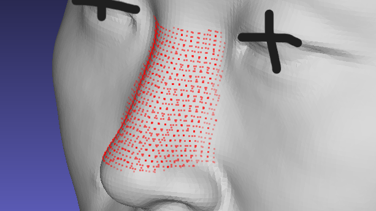
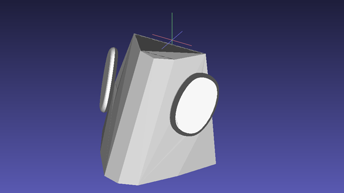

# Ergonomic Data sample

This is a sample of ergonomic data that I collected and processed while I served as Ergonomics Engineer at XREAL. The original data was derived from 3D scans of around one hundred volunteers, including both Asian and non-Asian individuals. The purpose of the data collection was to provide ergonomic references for the design of AR glasses, especially regarding the essential  metrics such as head breadth, nasal root width, alar slope angles, and the distance between the tragion and cornea, among others.

The raw data was processed through facial landmarks and coorination extraction using Python, ultimately generating targeted data reports and average models. These data and reports continue to be used as design references at XREAL.

Due to data ownership and copyright considerations, only some sample images of the data are presented here, along with the sample scripts I developed. Any human models or portraits shown in this presentation are of me (Email: derrickhhy@163.com) and do not involve any private information of the original data volunteers.

## ***Raw Data Sample:***

All raw data were collected by 3D scanning of volunteers' heads, through specialized scanning equipment. To compensate for the inherent limitations of depth-sensing mechanisms, additional physical adjustments were applied, such as depth distortion around areas like the connection between the ear and the head. Each raw head model was individually corrected and processed by me, including horizontal alignment, coordinate system unification, annotation of key facial landmarks, and removal of irrelevant scan artifacts. A sample of the individual head model is provided below (MY HEAD SCANNING). The corresponding 3D file can be found at *Sample_data/Model_Sample.obj*

  

## ***Data Processing:***

At that time, there was no ergonomic expert within the company to provide any guidance. As a result, I developed my own workflow based on methodologies from ergonomics and anthropometry literature, along with suggestions from my leader. Although the leader and colleagues appreciated my work, there are definitely some aspects that lack academic rigor. Any feedback or suggestions for improvement are welcome.

This section uses images and partial documentation to illustrate my data extraction process. The example chosen is the nasal region, which is essential for AR glasses comfort and design. The entire workflow includes other facial areas important for AR glasses design.

### ***Step 1 Manual Landmark Annotation***

The first step involves manually annotating key landmarks on each head model. Specifically, 19 landmarks are placed on the nasal region—represented by the 19 cones shown in the image below. This manual process was laborious. In the initial stages, the annotation on a single model took over 30 minutes. However, this approach was meaningful at the time, as it effectively prevented data distortion caused by unusual nasal shapes. While today, I might explore smarter automated or machine learning-based approaches. At that time, manual annotation was the most feasible approach I could implement with good precision.

  

### ***Step 2 Feature Data Extraction***
By capturing the coordinates of the landmarks, various nasal feature data could be calculated, such as width, height, inclination, and sharpness. Visual representations of these measurements are also provided in the image above. Subsequently, Principal Component Analysis (PCA) was applied to classify the data, helping to identify potential nasal types and  key features of nasal structures. Additionally, a simplified average model was generated using percentile-based methods, as shown in the figure below. Although the classifications produced at this stage are relatively coarse, they effectively visualize many key characteristics and provide a preliminary overview to guide further work.

  
  

### ***Step 3 Average Models***
Based on the data report from Step 2, a target region is defined for automated point extraction, encompassing all key feature information. Unlike manual annotation, this step involves capturing point coordinates more densely within the specified region, enabling the generation of smoother average head models that retain all relevant features. By applying the classification in Step 2, we can select specific subgroups of interest, such as Asian individuals or those with sharper nasal bridges, and then generate average head models for each subgroup, as shown in the figure below.

These average models can be 3D-printed to provide tangible design references. The script used for automated point extraction is available at *Sample_data/Step_3_PointGrab.py*. ***Note***: To protect critical data information, the shared script demonstrates the extraction logic using a relatively non-critical region (the forehead).

  
  

### ***Step 4 Design Suggestion***
My leader also expected me to provide direct design recommendations, beyond merely presenting key feature data and models. However, due to my limited knowledge in industrial design and eyewear design, I cannot be sure about the appropriateness of some of the suggestions I offered. For instance, based on the nasal slope characteristics derived earlier, I proposed a necessary adjustment range for the nose pads of AR glasses. The image below is a demonstration.

  
  

