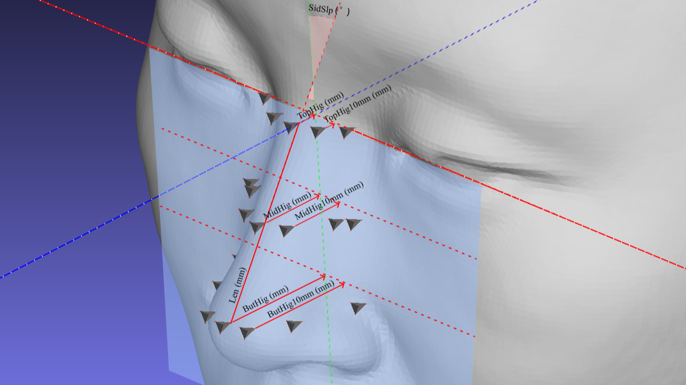

# Ergonomic Data sample

这些数据是我在XREAL作为人体工学工程师收集并处理的Ergonomic Data的样本。原始数据由扫描上百名志愿者的扫描电子模型组成，包括亚洲人与非亚洲人。数据收集的初衷为AR眼镜的外形设计提供Ergonomic参考，例如head breadth，Nasal root width，Alar slop angles，distance between tragion and cornea. etc。原始数据最终全部通过面部landmark 标记与数据提取（by Python）目标数据，最终生成目标数据报告与平局模型。这些数据与报告仍然被用于XREAL的设计参考。出于数据归属权和版权原因，此数据样本仅会展示部分数据展示的图片以及全部由我个人完成的数据提取脚本。展示过程中出现的任何个人模型或者人像，均是我本人的人像资料，不会涉及任何数据志愿者的隐私。注：若存在任何侵权或法律问题，请联系我以删除此展示。

## ***Raw Data Sample:***

所有的原始数据都是通过3D扫描仪器对志愿者完成头部的扫面。扫描过程中会通过物理的方式完成一些矫正，以弥补深度摄影机制的本质缺陷，例如耳根与头部相连处的深度信息失真。所有的原始头模都经过我个人的矫正与处理，包括水平校准，坐标系对其，关键面部landmark 标定，移除无关信息等。样板头模的图如下，3D文件信息可见XXfile中的XX文件。

## ***数据处理流程:***

公司内并没有相关人士提供指导，所以我只能根据文献中的方法学来建立我自己的工作流，文献涉及ergonomics and anthropometry。这一部分会通过图片和部分文件展示我的数据提取工作流。选3D模型的鼻子数据为例子，因为这个部位与AR眼睛的舒适度紧密相关。当然这部分工作也包含其他对于AR眼睛设计重要的面部位置。
### ***Step 1 手动标点***
首先会人工标记所有头模的关键点位。每个头模都会通过手动的方式定位19个landmark在鼻子上，也就是下图中呈现的19个锥形。这个手动过程是一个很繁重的任务。在最开始每个模型的标点都会花费我30小时以上的时间。但这样是有意义的，在当时确实避免很多特殊鼻形导致的数据失真。或许现在我会尝试更聪明的自动化或者机器学习的方法。不过在当时，这就是我个人最容易实现且误差最小的方法了。

  

### ***Step 2 特征数据***
通过提取步骤一中的landmark的坐标，可以计算很多的鼻子的特征数据，例如宽度，高度，倾斜，锋利程度等。这些数据的直观显示也呈现于上图.随后通过PCA来分类这些数据，以提供鼻子形状的分类模式或锁定亚洲人与外国人的鼻形差异的关键特征。当然，也可以通过简单的百分比方式生成平均模型如下图。这个阶段生成得分类模型虽然比较粗糙，但是可视化很多关键的特征，这为后续的工作方向提供了预览。
![Image text] PCA示例图还有三个鼻子得简单分类生成

  
  

### ***Step 3 平均头模***
根据第二步中的数据报告，我们划定一个自动坐标抓取的范围，包含所有关键的特征信息。与手动标记不同，这次在范围能更密集得抓取模型的点坐标，这可以帮助我们生成更平滑的平均头模，并且包含所有我们认为重要的特征。根据分类模式我们可以选取感兴趣的分类的子数据集（例如亚洲人或者尖鼻子的人），随后生成各个子集的平均头模。可以见下图。这样的平衡模型可以通过3D打印，给眼镜结构设计师提供更直接的参考。自动抓取的坐标的脚本可以见XXfile中的XX文件。（注，考虑到脚本中包含数据关键的信息，因此脚本展示选取了不重要部位（额头部位）的脚本以展示抓取逻辑）。

  
  

### ***Step 4 直接的设计建议***
当然，leader也期望我直接给出一切建议，而不仅仅是给出关键的特征数据与模型。不过我并不具备工业设计和眼镜设计的相关知识，因此我也并不确定部分设计建议是否恰当。这部分的例子是，我通用上述的关于鼻子的倾斜特征，给出AR眼镜鼻托必要的可活动范围，示范如下图

  
  

